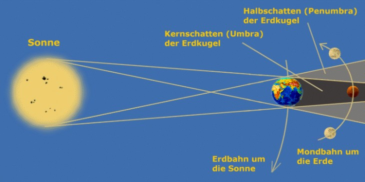

## Kernthemen 

1. Hintergrundinformationen zu diesem Blog

2. Beantwortung der Frage, was eigentlich "halbschattig" bedeutet

## Warum denn eigentlich noch ein Gartenblog?

Wir haben uns einige Blogs bereits angeschaut und vieles hat uns gefallen, sei es der Informationsgehalt, der Aufbau oder die Themenvielfalt. Eine Sache, die unserer Meinung jedoch fehlt, ist in den meisten Fällen die Übersichtlichkeit, eine kurze und zugleich verständliche Erklärung unterschiedlichster Fragestellung rund ums Gärtnern sowie auch die Möglichkeit noch etwas mehr Information sich über gewisse Themen einzuholen. 
Deshalb versuchen wir beim Design dieser Seite zu Beginn eines jeden Artikels möglichst kurz und eindeutig die Inhalte zu erläutern, sodass die Kerninhalte direkt vermittelt werden. Um unseren wissenschaftlichen Anspruch gerecht zu werden, werden wir so gut es geht unsere Quellen zu den Artikeln  verlinken sowie Erfahrungsberichte oder auch verschiedenste Experimente vorstellen. Also lasst euch überraschen!

## Wie kamen wir auf die Idee einen Blog zu machen?

Wie Eingangs erwähnt wollen wir möglichst interessant und einfach die Frage klären, [woran es eigentlich gelegen hat][3]. Und wenn du auf den Link geklickt hast, wirst du sehen, dass wir uns dabei auch nicht zu ernst nehmen und die Themen auch gerne aus einer humoristischen Perspektive betrachten.
Doch jetzt wieder Spaß beseite!

Beruflich und auch persönlich kommen wir aus der Wissenschaft, und daher beschäftigen wir uns oft mit den Fragen: wieso, weshalb, warum?
Bei den meisten wird im Ohr noch "wer nicht fragt bleibt dumm" nachhallen, und genau das war der eigentliche Anreiz für diesen Blog. Im persönlichen Austausch bei den ersten Versuchen des Urban Gardenings haben wir uns oft gegenseitig fragen gestellt, wie verschiedene Dinge bestmöglichst umgesetzt werden können, woher das ganze Ungeziefer kommt und wieso denn eigentlich die Pflanze schon wieder ihre Blätter verliert. 
Die Diskussionen haben anschließend auch Freunde und Kollegen aufgeschnappt, die eigentlich alle mit den gleichen Problemen zu kämpfen hatten.
Da dachten wir uns schlichtweg, hier gibt es Nachholbedarf!

Und da wir nicht das Gärtnern neu erfinden, wollen wir ebenfalls unsere Quellen mit einbinden. Denn unsere Aussagen werden dabei meist durch das Lesen von anderen Büchern, Webseiten oder Blogs bestimmt, sodass wir diese auch mit Verlinken werden. Denn erstens haben die Autoren es verdient, mit erwähnt zu werden und zweitens wollen wir damit auch euch die Möglichkeit geben, mehr über gewisse Themen zu erfahren, falls wir ein Thema für euren Geschmack etwas zu wenig ausleuchten.

## Eine Homage an das Gärtnern

## Was ist eigentlich halbschattig?

> Halbschatten bedeutet, dass die Pflanze gerne den halben Tag in der Sonne steht (ca. 4-6h) [[5][5],[6][6]]. Dabei präferieren Pflanzen eher die Morgen- oder Abendsonne, da die Mittagssonne meist zu intensiv ist. Als kleiner Tipp: Wenn man von der Pflanze aus die Sonne sehen kann, dann steht sie auch in der Sonne.

Bereits auf der Startpage angeschnitten, wollen wir abschließend den Begriff "halbschattig" näher betrachten. 
Eine [astronomische Erläuternung][7] des Begriffs "Halbschatten" liefert dabei die nachfolgende Abbildung.

Scheint die Sonne auf die Erde, so bilden sich wie in der obigen Abbildung dargestellt zwei Zonen hinter der Erde aus. Einmal die Umbra, der sogenannte Kernschatten. Dort ist es dunkel, und wenn der Mond wie dargestellt sich in dieser Zone befindet, spricht man von einer Mondfinsternis. Der für uns jedoch wesentlich wichtigere Teil ist die Penumbra, welche nur von einem Teil der Lichtquelle beleuchtet wird.
Versucht man dies jetzt auf die Position der Pflanzen in der Wohnung oder im Garten zu beziehen, ist dies intuitiv nicht direkt möglich. Erstens sind Effekte mit Schattenwürfe immer zeitabhängig, da die Sonne im Tagesverlauf über den Horizont wandert. Zweitens weiß man ja jetzt nicht, zu welcher Zeit die Pflanze im Halbschatten stehen muss. Und da kommen wir dem Problem auf die Schliche! Der Begriff Halbschatten bedeutet bezogen auf die Botanik keinesfalls, dass die Pflanze in der Penumbra eines anderen Objektes stehen muss, sondern vielmehr das über einen Tag betrachtet die Pflanze im Mittel in solch einer Zone steht. Das bedeutet wiederum, dass die Pflanze in einer gewissen Zeit sehr wohl direkter Sonneneinstrahlung ausgesetzt werden darf, aber halt nicht dauerhaft [[8][8]]. Somit kann bei einer durchschnittlichen Sonnenbelichtung von 4-6h pro Tag von einem Halbschattigen  Plätzchen gesprochen werden.

<!--
* [gelegen][3]
* [gelegen][4]
* Für alle Leute, die keinen grünen Daumen haben aber gerne was anpflanzen würden
* waren selbst immer etwas genervt von undeutlichen Aussagen bzgl. Halbschatten und mittelmäßig viel gießen
* als wissentschaftler finden wir präzise angaben wichtig
* diesen Scientific Approach mit Witz wollen wir hier vermitteln und dies möglichst einfach
* generell kurze knappe Infos und wer will kann auch ausführlichere Berichte lesen, die immer auch etwas humoristisch aufgefasst werden sollten
* Literatur wird immer mit verlinkt sowie um eigene Erfahrungsberichte ergänzt
* wir versuchen nach möglichkeit auch eigene Studien zu fahren, jedoch natürlich nur im geringen Umfang
* wollen etwas für das Umweltbewusste Leben tun ohne sich jetzt als großer weltverbesserer darstellen zu wollen
* sehr positives gefühl, wenn man etwas wachsen sieht
* Pflanzen haben sehr viele positive Eigenschaften und sehen auch noch schön aus
* ich persönlich bin nicht so der Blumentyp aber bestimmte Nutzpflanzen erzielen auch einen guten Effekt
* essen schmeckt gleich besser mit eigenen Kräutern
* unabhängig von Supermarkt und meißt zugang zu frischen kräutern
* wollen auch über unsere Probleme beim Anbau schreiben und wie wir diese gelöst haben
* Grundidee ist es, durch smarte Verlinkungen und eine strukturierte Darstellung den Leser möglichst schnell zu den gewünschten Informationen zu bringen
* ggfls. mit wissenschaftlichen Studien stützen
* Vergleiche machen, eventuell auch preislicher Natur 
* und am Ende auch etwas selbstverwirklichung und spaß am bloggen sowie an der Verwicklichung von eigenen Ideen
-->

<!-- Quelle: --> 

[1]: http://github.com
[2]: {{ site.url}}/nutzpflanzen/tomaten/
[3]: http://youtube.com/watch?v=ElWOGVqNGTQ
[4]: https://www.youtube.com/watch?v=ElWOGVqNGTQ
[5]: https://www.gartengnom.net/licht-ins-dunkel-absonnig-halbschattig-schattig/
[6]: https://volmary.de/planthappy/halbschatten-sonne-vollsonne-pflanzen-standort/
[7]: https://www.astronomie.de/das-sonnensystem/der-erdtrabant/mondfinsternis/entstehung/
[8]: https://www.dlr-rheinpfalz.rlp.de/Internet/global/themen.nsf/%0BALL/A21F92D29BB28082C125707C0039947B?OpenDocument

